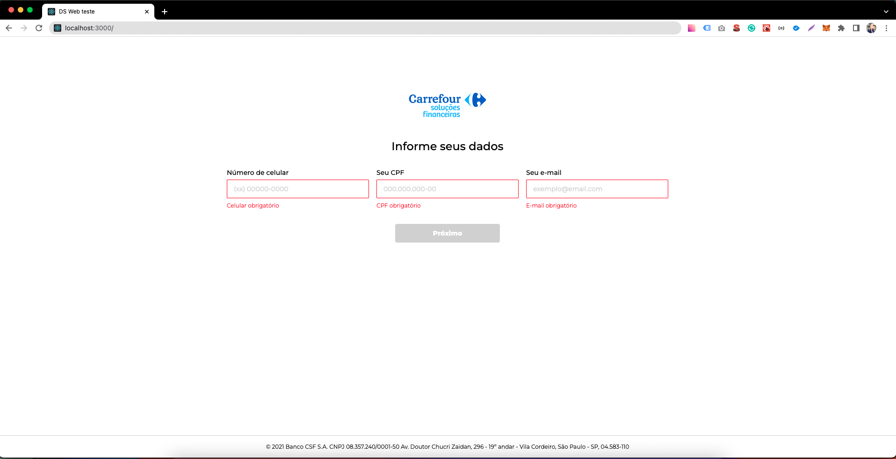
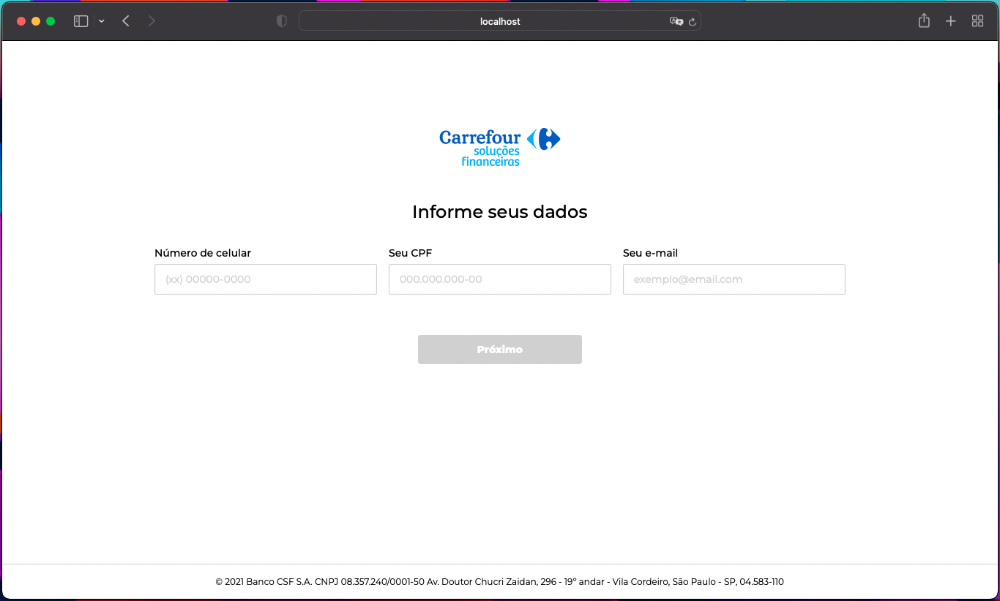
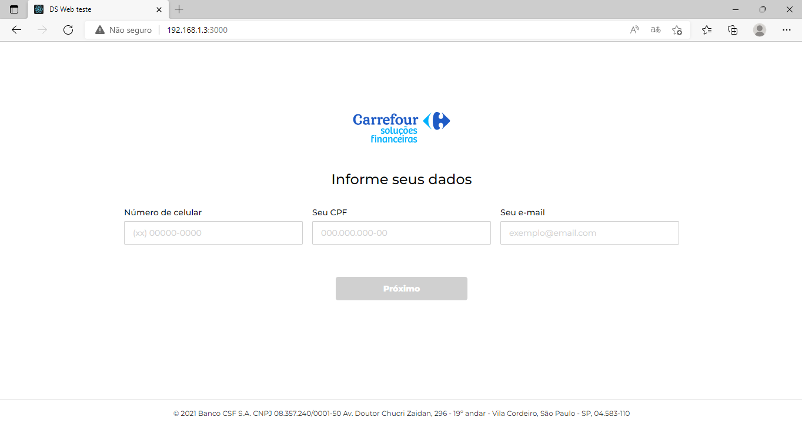
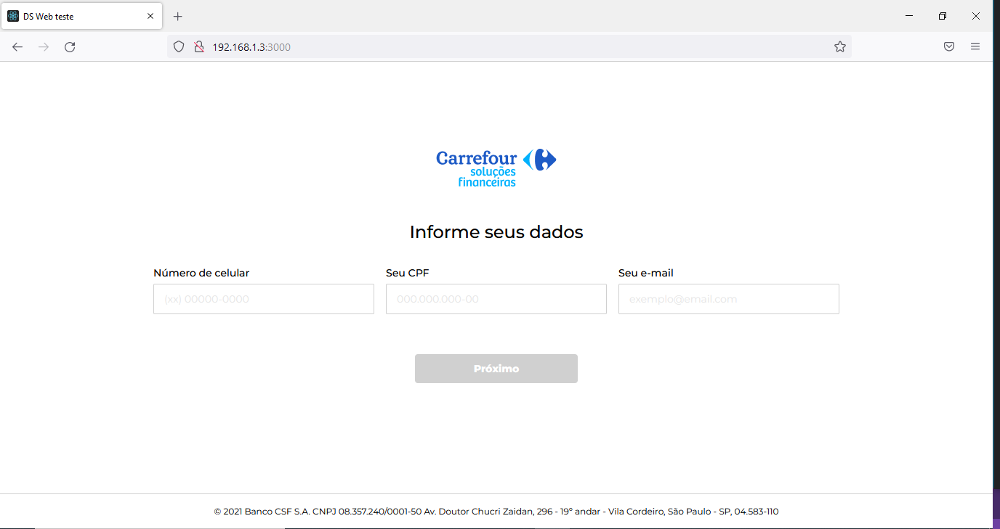
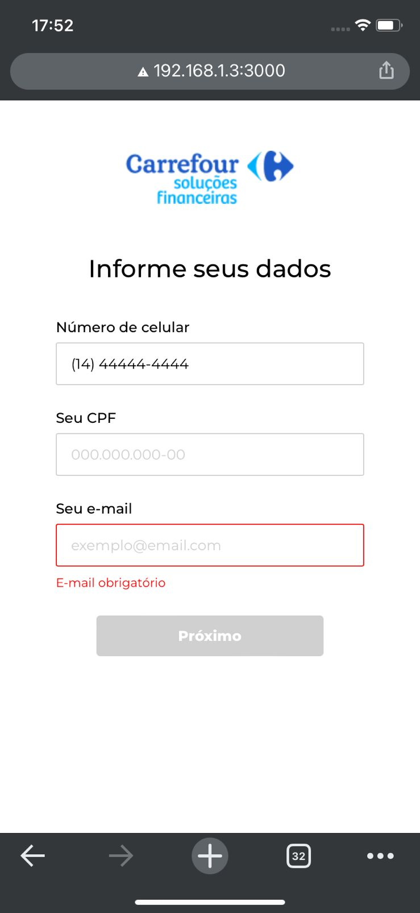
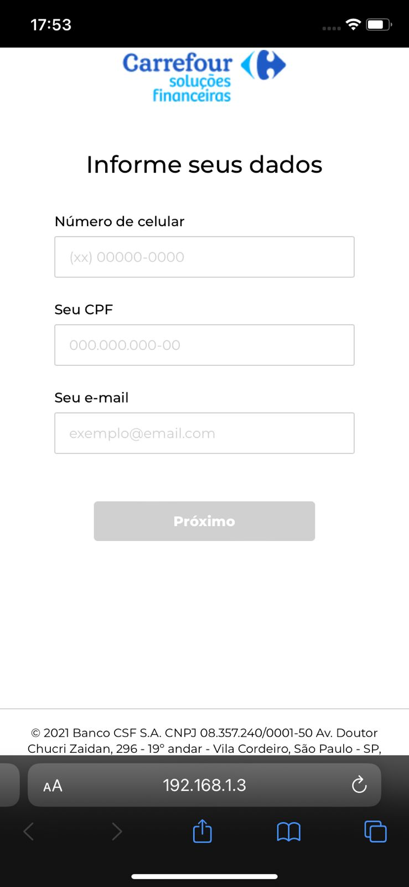

<h1 align="center">DS Web Teste</h1>
<br>
<h3 align="center"> 🚀 Challenge for The bridge 🚀 </h3>

## Link to figma
<a href="https://www.figma.com/file/7njyPDwM2R1HzaksCSIKlK/DS-web-teste" target="_blank">
 ✏️ Figma ✏️
</a>

## Rules 💻 
<hr>
    <ul>
        <li>Criar o layout de acordo com o Protótipo</li>
        <li>Todos os 3 campos (CPF, celular e e-mail) são obrigatórios </li>
        <li>Se os dados preenchidos no formulário estiverem válidos (apenas o preenchimento e não a validação do dado em si) o botão 'enviar deve ser habilitado</li>
        <li>Ao clicar no botão "Enviar" todas as informações preenchidas em cada campo deve aparecer no console dentro de um objeto para demonstrar a funcionalidade</li>
    </ul>

## Tools 🛠️
<hr>
 - React
 <br>
 - Further increase the knowledge base of beginning devs.

## Screenshots Cross-Browser 🖼
<hr>
 - Chrome (desktop)
 
 - Safari (desktop)
 
 - Edge (desktop)
 
 - Firefox (desktop)
  
 - Chrome (iPhone 11)
  
 - Safari (iPhone 11)
  

## Technologies used 🛠
<hr>
<p align="left">
<a href="https://reactjs.org/" target="_blank">

</a>
-
<a href="https://www.typescriptlang.org/" target="_blank">

</a>
-
<a href="https://sass-lang.com/" target="_blank">

</a>
</p>

## Getting Started 👷
<hr>
To start development, you need to clone the GitHub project into a directory of your choice:

```shell
cd "directory of your choice"
git clone https://github.com/Thejuniordev/ds-web-teste.git
```

First, instal node_modules:

```bash
npm i
# or
yarn
```

Next, run the development server:

```bash
npm start
# or
yarn start
```

Open [http://localhost:3000](http://localhost:3000) with your browser to see the result.

 ## Author 🎓
 <hr>

<table align="center">
    <tr>
        <td align="center">
            <a href="https://github.com/Thejuniordev">
                
                <br />
                <sub><b>Junior Alves</b></sub>
            </a>
        </td>    
    </tr>
</table>
<br /> 

<h4 align="center">
   Made with 💜  by  <a href="https://www.linkedin.com/in/junior-alves-3a8b3296/" target="_blank"> Junior Alves 👋🏽 Entre em contato!</a>
</h4>

 <a href="https://twitter.com/junyor_alves" target="_blank">
    
  </a>

<hr>
